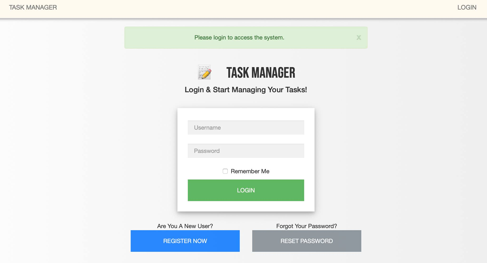

# Task Manager App
A Task Management System that can keep track and manage your ToDo tasks. Users need to register and login to access the system. Once a task gets completed, it will automatically be added to the Task Report calculating the number of hours worked on that particular task.

This App is multi-language supported: English and Japanese. Depending on user's web browser language setting, the equivalent language will be displayed.

URL: https://todosys.herokuapp.com

## Technology Used
Python 🐍 (Flask Framework), HTML5, CSS3, Javascript, jQuery

## Web Server
Gunicorn

## Deployment
Heroku

## Author
Jeet Z. H. Khondker - Full Stack Python Developer

